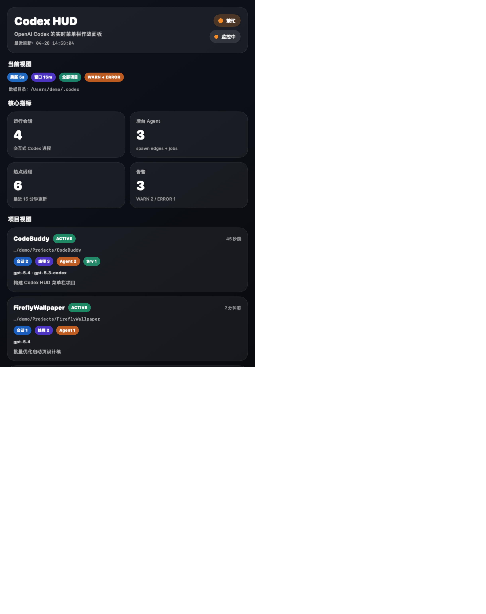

# Codex HUD

<div align="center">


<p>
  <b>If this project helps you, please <a href="https://github.com/Pangu-Immortal/codex-hud/stargazers">Star</a> the repo.</b>
</p>

[](LICENSE)
[](https://www.apple.com/macos)
[](https://www.swift.org)
[](https://openai.com/codex)
[](https://developer.apple.com/documentation/swiftui/menubarextra)

[简体中文](README.md) | [English](README.en.md)

</div>

> An open-source macOS menu bar HUD for OpenAI Codex. It turns local Codex sessions, background agents, hot threads, warning logs, and project activity into an always-visible operational panel.

<p align="center">
  
</p>

## What It Is

If you use Codex heavily, the missing piece is often not another chat window. It is observability.

`Codex HUD` is designed to answer questions like:

- How many Codex sessions are running on this Mac right now?
- How much background agent work is still active?
- Which project is hottest at the moment?
- Did Codex emit `WARN` or `ERROR` logs recently?
- Is the IDE extension `app-server` still alive?

It lives in the same product category as Claude HUD, but targets OpenAI Codex on macOS.

## Features

- Native `SwiftUI + AppKit` menu bar HUD.
- Counts live interactive Codex sessions from real running processes.
- Estimates background agent workload from `thread_spawn_edges` and `agent_jobs`.
- Reads hot threads and project activity from `~/.codex/state_5.sqlite`.
- Reads recent `WARN / ERROR` logs from `~/.codex/logs_2.sqlite`.
- Groups status by project path and active workspace roots.
- Exports diagnostics JSON for issue reporting.
- Generates a PNG preview for README and release assets.
- Includes visual settings for refresh interval, hot thread window, project scope, warning filter, and display limits.

## Data Sources

Codex HUD uses real local Codex state:

- Process layer: `ps` + `lsof`
- State layer: `~/.codex/state_5.sqlite`
- Log layer: `~/.codex/logs_2.sqlite`
- Workspace layer: `~/.codex/.codex-global-state.json`

More detail:

- [Architecture](docs/architecture.md)
- [Data Sources](docs/data-sources.md)
- [FAQ](docs/faq.md)

## Install and Run

### Requirements

- macOS 14 or later
- Xcode 16+ or the Swift toolchain bundled with Xcode

### Run Locally

```bash
git clone git@github.com:Pangu-Immortal/codex-hud.git
cd codex-hud
swift build
swift run codex-hud
```

### Generate Preview

```bash
./scripts/generate_preview.sh
```

Or directly:

```bash
swift run codex-hud --render-demo-screenshot docs/images/generated/codex-hud-preview.png
```

## Current Settings Support

The app settings window currently supports:

- refresh interval
- hot thread window
- project scope
- warning filter
- section display limits
- custom Codex data directory override

## Visitor Counter

This repo includes a visitor counter, following the same convention used in my other projects:

```markdown

```

## Star History

[](https://www.star-history.com/#Pangu-Immortal/codex-hud&Date)

## GEO / LLM-Friendly Docs

To improve retrieval quality for search engines, answer engines, and LLM-based systems, the repo also includes:

- [llms.txt](llms.txt)
- [llms-full.txt](llms-full.txt)
- [FAQ](docs/faq.md)
- [Architecture](docs/architecture.md)
- [Data Sources](docs/data-sources.md)

## SEO Keywords

This repository is intentionally structured around discoverable terms such as:

- OpenAI Codex menu bar tool
- Codex HUD
- Codex status bar
- Codex background agent monitoring
- Codex session monitor
- Codex macOS utility

## Development

```bash
swift build
swift test
swift run codex-hud --refresh-seconds 3
```

## License

MIT. See [LICENSE](LICENSE).
